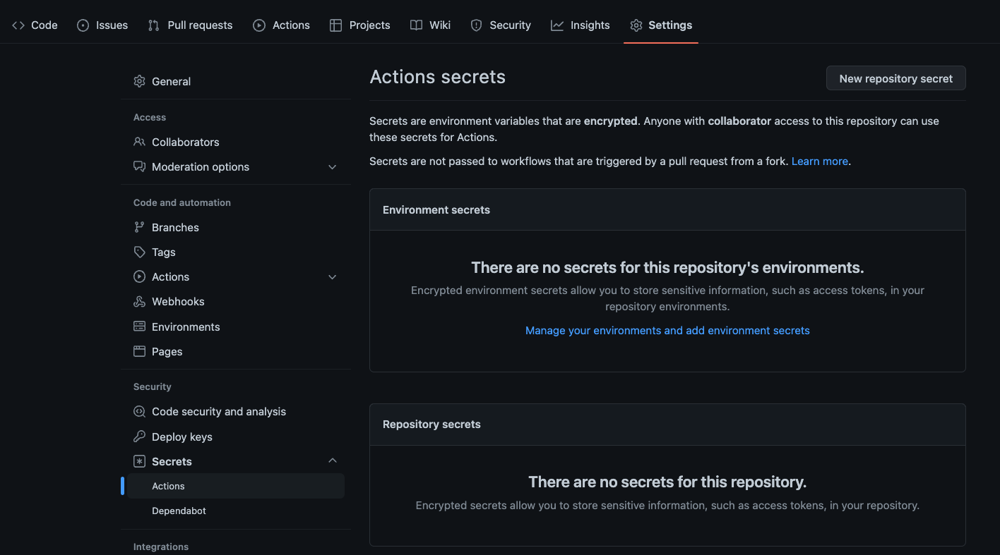
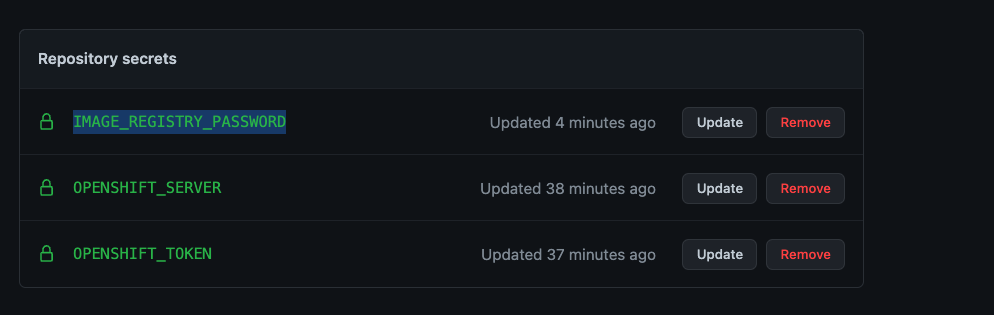
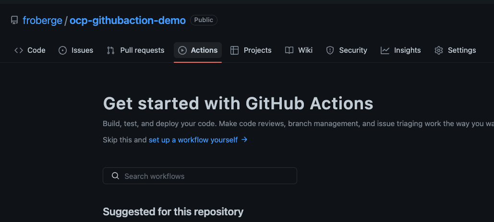
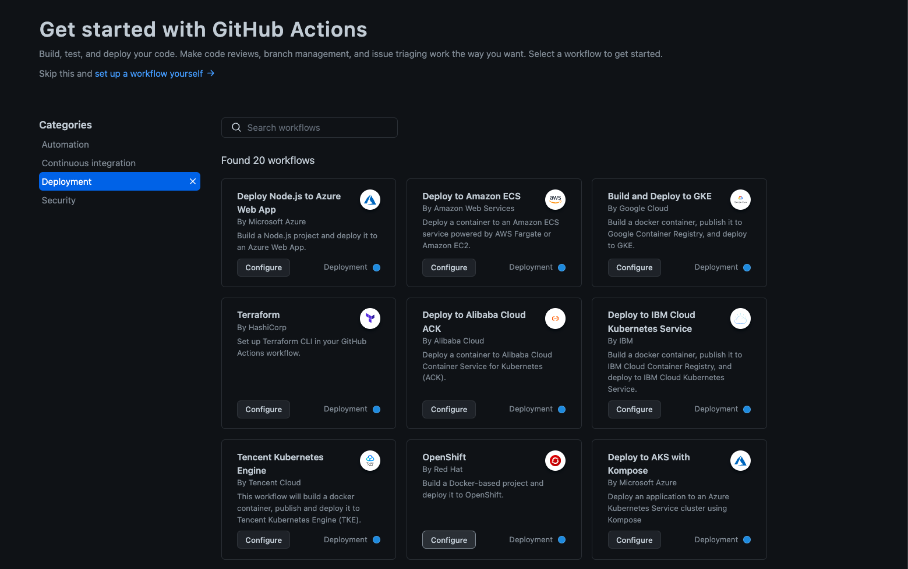
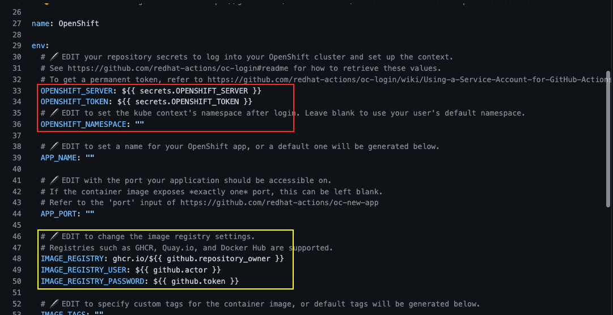
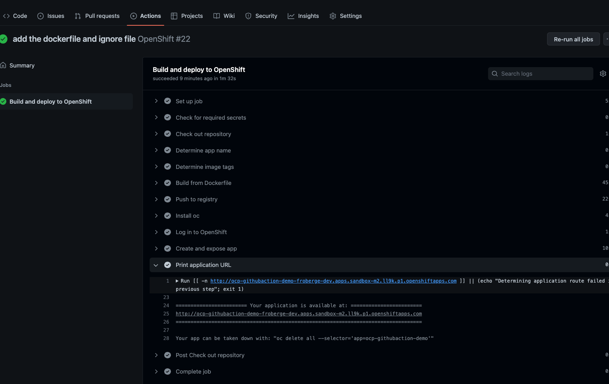
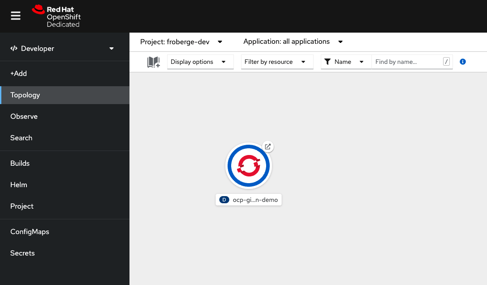

# Introduction to using GitHub Actions Runner on OpenShift.

Welcome to the Introduction to using GitHub Actions Runner on  OpenShift !! 


This demo will show how to use self-Hosted GitHub Actions Runners to build and deploy a Quarkus application. For more information on the code refer [here](docs/app-README.md).

## GitHub Action
[GitHub Action](https://github.com/features/actions), automate, customize and execute your software development workflows right in your repository. You can discover, create and share actions to perform any job you'd like, including CI/CD and combine theses actions in a completely customized workflow.


## GitHub Action Runner
[GitHub Action Runner](https://github.com/actions/runner), is the application that runs a job from a GitHub Actions workflow. It is used by GitHub Actions in the hosted virtual environments, or you can self-host the runner in your own environment.

By default, the infrastructure is provides by GiHub, however, it possible for users to run their own runners, this is call `Self-hosted runners`. They can be almost any physical or virtual machine, with the the runner software supporting many operating systems and architectures.

Benefits:
1. Works with GitHub Enterprise Service.
1. No Usage limits
1. Persistent disk


## Overview

In this demo we will walk you through how to use a self-hosted `GitHub Action Runner` on openshift, to build and deploy code on `Red Hat Openshift`. Wee will also secure the GitHub Action using [Azure Key Vault](https://azure.microsoft.com/en-us/services/key-vault/#product-overview). We will take a look at the self-hosted runner, to run a customize and secure GitHub Actions Workflows using different component from the [Red Hat GitHub Action Page](https://github.com/redhat-actions).


### Prerequisites

* Any Openshift cluster 4.x.
* OpenShift CLI `oc` install and connected to your cluster
* [Helm](https://helm.sh/)
* Access to [GitHub](https://github.com)
* Access to [Quay.io](https://quay.io/)
* Access to [Azure Porttal](https://portal.azure.com/#home)


#### OpenShift Actions runners
The easiest way to add self-hosted runners to your Red Hat OpenShift environment is to use the `OpenShift Actions Runner Installer`.

1.

For this demo we will be using GitHug Actions runners onto an existing OpenShift cluster. Red Hat as developed a set og tools to help installing this.
* [OpenShift Action runner](https://github.com/redhat-actions/openshift-actions-runners) which consist of a set of container images tahat run the GitHub Actions runner
* [OpenShift Runner Chart](https://github.com/redhat-actions/openshift-actions-runner-chart), Helm chart to deploy pods from those images.
* [OpenShift Actions Runner Installer](https://github.com/redhat-actions/openshift-actions-runner-installer), an action to automate the helm install, building the runner mangement into your workflows.

###### OpenShift Action Runner Installer

1. Connect to OpenShift.
2. Create a new project
    ```
    oc new-project github-runner
    ```
3. Follow the steps listed to install [openshift-action-runners](https://github.com/redhat-actions/openshift-actions-runners)


---

We need to create 3 secrets in the repository for the workflow to use.

1. The registry repository secret
2. The OpenShift server location
3. The OpenShift Token

* In the repository go to `Settings -> Secrets -> Actions `

* Select New repository secret to create the first secret.
    * Enter the name: `IMAGE_REGISTRY_PASSWORD`
    * Enter the value:  The token value for quay.io

* Enter another repository secret
    * Enter the name: `OPENSHIFT_SERVER`
    * Enter the value:
        * The cluster url retrieved with the OpenShift CLI.
            ```
            oc whoami --show-server
            ```
* Enter another repository secret
    * Enter the name: `OPENSHIFT_TOKEN`
    * Enter the value:  :warning: __This is a temporary token__
        * Enter the token retrieved with the OpenShift CLI.
            ```
            oc whoami --show-token
            ```
    :zap:Create a service account in orther to have a more permenent solutions. [Follow this link](https://github.com/redhat-actions/oc-login/wiki/Using-a-Service-Account-for-GitHub-Actions) to know how. Use that token instead.

    :clipboard: Make sure you have the permission on the user.
    >oc policy add-role-to-user edit system:serviceaccount:[NAMESPACE]:[SERVICE_ACCOUNT]

   
 
#### Setup the GitHub Action.

1. Access GitHub.com in the proper repository and go in to the Actions tab.


1. Scroll down to the deployment section and select `OpenShift`. 


1. Click on `Configure` to edit the yaml



###### Setup the image registry
:warning: for the image registry access I use a Robot that I have created in quay.io instead of my own username/password.

* OPENSHIFT_NAMESPACE: Enter the namespace to use.
* IMAGE_REGISTRY: enter your quay.io repository
* IMAGE_REGISTRY_USER: enter the robot login name
* IMAGE_REGISTRY_PASSWORD: replace by a secret value ${{ secrets.IMAGE_REGISTRY_PASSWORD }} ```

* Click `Start commit`


* The pipeline should start executing and you can check it executing.


:eyeglasses: You can access the application by clicking on the link highlighted above.

You should now see your apps in OpenShift


---