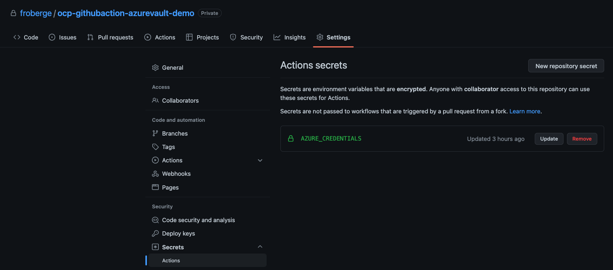
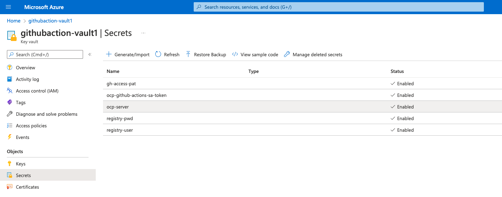

[](https://github.com/froberge/ocp-githubaction-azurevault-demo/actions/workflows/openshift-s2i.yml)

# Introduction to using GitHub Actions Runner on OpenShift.

Welcome to the Introduction to using GitHub Actions Runner on  OpenShift !! 


This demo will show how to use self-Hosted GitHub Actions Runners to build and deploy a Quarkus application. For more information on the code refer [here](docs/app-README.md).

## GitHub Action
[GitHub Action](https://github.com/features/actions), automate, customize and execute your software development workflows right in your repository. You can discover, create and share actions to perform any job you'd like, including CI/CD and combine theses actions in a completely customized workflow.


## GitHub Action Runner
[GitHub Action Runner](https://github.com/actions/runner), is the application that runs a job from a GitHub Actions workflow. It is used by GitHub Actions in the hosted virtual environments, or you can self-host the runner in your own environment.

By default, the infrastructure is provides by GiHub, however, it possible for users to run their own runners, this is call `Self-hosted runners`. They can be almost any physical or virtual machine, with the the runner software supporting many operating systems and architectures.

Benefits:
1. Works with GitHub Enterprise Service.
1. No Usage limits
1. Persistent disk

#### OpenShift Actions runners
The easiest way to add self-hosted runners to your Red Hat OpenShift environment is to use the `OpenShift Actions Runner Installer`.

For this demo we will be using GitHug Actions runners onto an existing OpenShift cluster. Red Hat as developed a set of tools to help installing this.
* [OpenShift Action runner](https://github.com/redhat-actions/openshift-actions-runners) which consist of a set of container images tahat run the GitHub Actions runner
* [OpenShift Runner Chart](https://github.com/redhat-actions/openshift-actions-runner-chart), Helm chart to deploy pods from those images.
* [OpenShift Actions Runner Installer](https://github.com/redhat-actions/openshift-actions-runner-installer), an action to automate the helm install, building the runner mangement into your workflows.


## Overview

In this demo we will walk you through how to use a self-hosted `GitHub Action Runner` on openshift, to build and deploy code on `Red Hat Openshift`. Wee will also secure the GitHub Action using [Azure Key Vault](https://azure.microsoft.com/en-us/services/key-vault/#product-overview). We will take a look at the self-hosted runner, to run a customize and secure GitHub Actions Workflows using different component from the [Red Hat GitHub Action Page](https://github.com/redhat-actions).


### Prerequisites

* Any Openshift cluster 4.x.
* OpenShift CLI `oc` install and connected to your cluster
* [Helm](https://helm.sh/)
* Access to [GitHub](https://github.com)
* Access to [Quay.io](https://quay.io/)
* Access to [Azure Porttal](https://portal.azure.com/#home)
---

### DEMO

#### Creation of the Azure Key Vault
In your azure subsctiption create a new Key Vault.
Name: `githubaction-vault1`

#### Creation of the Azure Service Principal to access Key Vault.

1. Create a Service Principal for github to access the KeyVault
    ```
    az ad sp create-for-rbac --name github-action --role contributor --scopes /subscriptions/{subscriptionID}/resourceGroups/{resourcegroup} --sdk-auth
    ```

Result. 
This will return a JSON, you only need the following items. The clientId is needed for the permission grant.

```
    {
        "clientId": "<GUID>",
        "clientSecret": "<GUID>",
        "subscriptionId": "<GUID>",
        "tenantId": "<GUID>"
    }
```

2. Grant access to the service principal to the key Vault to retrieve the different secrets

    ```
    az keyvault set-policy -n githubaction-vault1 --secret-permissions get list --spn {clientIdGUID}
    ```

3. In GitHub create a secret `AZURE_CREDENTIALS` that contains the content of the JSON above.



---

### Creation of a Service Account in OpenShift

When logging in to an OpenShift cluster from an automated environment, it is recommended to use a functional Service Account rather than personal credentials. Refer [here](https://cookbook.openshift.org/accessing-an-openshift-cluster/how-can-i-create-a-service-account-for-scripted-access.html).

Steps: ( They were validated on MacOs/Linux)
1. Define the service account name
    ```
    export SA=github-actions-sa
    ```
1. Create the service account.
    ```
    oc create sa $SA
    ```
1. Find the secrest that were created.
    ```
    export SECRETS=$(oc get sa $SA -o jsonpath='{.secrets[*].name}{"\n"}') && echo $SECRETS
    ```
1. Describe the secret that contains the word `token. We will need this token in the Key Vault later.
    ```
    oc describe secret github-actions-sa-token-[REPLACE_WITH_YOUR_VALUE]
    ```
1. Give write permission to the Service Account
    ```
    oc policy add-role-to-user edit -z $SA
    ```
---

### Adding secret in Azure Key Vault.

We need to create 3 secrets in the azure key vault.

1. `registry-pwd` -> The registry service account connection password.
    Can be found on the registry. in this case we use quay.io
1. `registry-user` -> The registry service account user
1. `ocp-server` -> The OpenShift server location
    ```
    oc whoami --show-server
    ```
1. `ocp-github-actions-sa-token` -> The service account access token.   
    Retrieve at the previous step. Creation of a service account.
1. `gh-access-pat` -> The Service account [Github personnal access token](https://docs.github.com/en/authentication/keeping-your-account-and-data-secure/creating-a-personal-access-token).



---

#### Pipeline Path


